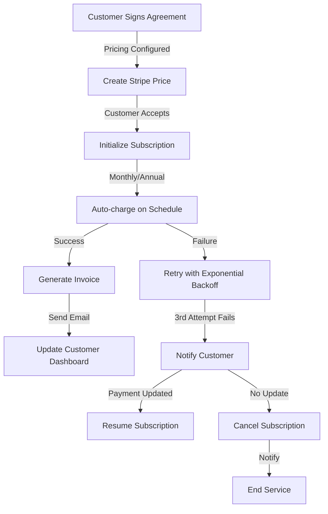

# Building Owner (Customer) Portal - Architectural Review & Enhancement Plan
**Date:** February 2, 2026  
**Role:** Solutions Architect  
**Status:** Comprehensive Assessment Complete

---

## Executive Summary

Your Building Owner Portal demonstrates **solid engineering fundamentals** with well-structured components, security-conscious design, and good separation of concerns. However, there are **strategic opportunities** for enhancement in three critical areas: **Email/Notifications implementation**, **Payments/Subscriptions architecture**, and **Design refinements**.

### Overall Assessment: **8/10**

**What You've Done Well:**
- ✅ Clean, modular component architecture
- ✅ Comprehensive security model (Firestore rules, role-based access)
- ✅ Dashboard customization with widget system
- ✅ Multi-language support (Danish, German, English)
- ✅ Responsive design for mobile/desktop
- ✅ Service agreement template system with pricing flexibility
- ✅ Building/property management with geolocation
- ✅ Recent performance optimizations (selective data loading, memoization)

**What Needs Improvement:**
- 🟡 Email notifications system is **dormant** (built but not wired)
- 🟡 No payment/subscription infrastructure
- 🟡 Missing customer onboarding flows
- 🟡 Limited analytics/reporting for customer insights
- 🟡 No renewal/contract management system

---

## 1. Current Architecture Analysis

### 1.1 Portal Structure

```
Building Owner Portal
├── Authentication (AuthContext + Firestore custom claims)
├── Dashboard (Customizable widget system)
│   ├── Portfolio Health Summary
│   ├── Buildings Management
│   ├── Service Agreements
│   ├── Scheduled Visits
│   └── Reports & Documents
├── Core Features
│   ├── Building Management (CRUD + Map visualization)
│   ├── Service Agreements (7-day expiration + acceptance flow)
│   ├── Scheduled Visits (appointment management)
│   ├── Profile Management
│   └── Document Upload
└── Supporting Systems
    ├── Notifications (UI exists, backend dormant)
    ├── Preferences (Dashboard customization)
    └── Email Templates (Handlebars-based)
```

### 1.2 Data Model

**Strong Points:**
- Building document includes: address, coordinates, photos, inspection history
- Service Agreements with flexible pricing (per-roof, per-m², billing frequency)
- Customer profile linked to multiple buildings
- Scheduled visits with status tracking
- Reports with cost estimates and recommendations

**Opportunities:**
- Missing: **Subscription status tracking** on customer record
- Missing: **Payment method storage** (PCI compliance needed)
- Missing: **Invoice/billing history** collection
- Missing: **Contract renewal dates** on agreements
- Missing: **Service usage metrics** for analytics

### 1.3 Current Email System

**What Exists:**
```
email/templates/
├── offer-accepted.hbs ✅
├── offer-rejected.hbs ✅
├── offer-reminder.hbs ✅
├── password-reset.hbs ✅
├── report-ready.hbs ✅
└── urgent-issues.hbs ✅
```

**Status:** Email framework is ready but **not actively triggered** for customer events.

**Missing Triggers:**
- 🚫 Service agreement accepted/rejected notifications
- 🚫 Scheduled visit reminders (24h before)
- 🚫 Invoice/payment notifications
- 🚫 Building health degradation alerts
- 🚫 Report ready notifications to customer
- 🚫 Subscription renewal reminders

---

## 2. DESIGN EVALUATION

### 2.1 Portal Design Strengths ✅

**UI/UX Achievements:**
- Consistent Tailwind-based design system
- Accessible components (ARIA labels, semantic HTML)
- Responsive mobile-first design
- Clear visual hierarchy with icons and colors
- Smart dashboard customization (drag-drop, enable/disable widgets)
- Good error handling with user-friendly messages

**Information Architecture:**
- Intuitive navigation breadcrumbs
- Clear hierarchy: Buildings → Details → Reports
- Context-aware actions (no orphaned buttons)
- Logical section grouping (pricing, services, documents)

### 2.2 What Can Be Fixed

#### **2.2.1 Customer Onboarding Flow** 🔴
**Current State:** Basic signup → Portal
**Problem:** No guided introduction to platform features

**Recommendations:**
```typescript
// src/components/portal/OnboardingFlow.tsx (NEW)
export interface OnboardingStep {
  id: 'welcome' | 'buildings' | 'agreements' | 'visits' | 'reports';
  title: string;
  description: string;
  component: React.ComponentType;
  targetSelector?: string; // For tour highlighting
  actionLabel: string;
}

// Implement: Welcome modal → Feature tour → First building creation
// Use: https://github.com/shipshapecode/shepherd (tour library)
```

**Benefits:**
- Reduces support tickets (self-guided)
- Increases feature adoption (users know about capabilities)
- Better first-impression experience

---

#### **2.2.2 Mobile Dashboard Optimization** 🟡
**Current State:** Responsive but not optimized for touch/small screens

**Issues:**
- Complex widgets stack poorly on mobile
- Map widget becomes difficult to use on small screens
- Pricing tables hard to read (small text)

**Recommendations:**
```tsx
// Card-based layout for mobile
const isMobile = useMediaQuery('(max-width: 768px)');

return (
  <div className={isMobile ? 'flex flex-col gap-2' : 'grid grid-cols-3 gap-4'}>
    {widgets.map(w => (
      <WidgetCard key={w.id} compact={isMobile} />
    ))}
  </div>
);

// Use: Single-column layout with card expansion
// Add: Swipeable card carousel for top insights
// Replace: Map widget with simplified location picker on mobile
```

---

#### **2.2.3 Visual Consistency & Branding** 🟡
**Current State:** Good baseline, but could be stronger

**Improvements:**
```
1. Create consistent color palette for status indicators:
   ✅ Healthy building → Green (#10B981)
   🟡 Needs attention → Amber (#F59E0B)
   🔴 Urgent → Red (#EF4444)
   ⚪ Unknown/New → Gray (#6B7280)

2. Add building health dashboard cards with:
   - Visual health score (0-100 gauge)
   - Last inspection date
   - Days to next due inspection
   - Critical issues count
   - Trending indicator (↑/→/↓)

3. Implement consistent empty states:
   - Illustrations for empty buildings list
   - Helpful "Create first building" prompt
   - Link to getting started guide
```

---

#### **2.2.4 Customer Self-Service Options** 🟡
**Missing Features:**
- Download past invoices/reports (currently no invoice system)
- Manage email preferences (exists but not linked to portal)
- Update building information
- Renew/modify service agreements
- Schedule calls/support requests

**Implementation:**
```tsx
// src/components/portal/CustomerSettings.tsx (ENHANCE)
const CustomerSettings = () => {
  return (
    <div className='space-y-6'>
      {/* Email Preferences */}
      <section>
        <h2>Communication Preferences</h2>
        <EmailPreferencePanel />
      </section>

      {/* Billing */}
      <section>
        <h2>Billing & Invoices</h2>
        <BillingHistory /> {/* NEW */}
        <PaymentMethods /> {/* NEW */}
      </section>

      {/* Documents */}
      <section>
        <h2>My Documents</h2>
        <DocumentLibrary /> {/* NEW - agreements, reports, invoices */}
      </section>
    </div>
  );
};
```

---

## 3. EMAIL & NOTIFICATIONS IMPLEMENTATION

### 3.1 Current State

**What Exists (Backend):**
- ✅ `notificationService.ts` - Full CRUD for notifications
- ✅ `NotificationContext.tsx` - Real-time Firestore listener
- ✅ `NotificationCenter.tsx` - UI component with unread count
- ✅ Email templates in Handlebars format
- ✅ Firebase Cloud Functions capability

**What's Missing (Integration):**
- 🚫 Notification triggers are **never called**
- 🚫 Email sending not wired to events
- 🚫 No scheduled reminder system
- 🚫 No email provider configured (Sendgrid, Mailgun, etc.)

### 3.2 Recommended Implementation Plan

#### **Phase 1: Email Service Provider Integration**

**Option A: Firebase Cloud Functions + Mailgun (Recommended)**
```typescript
// functions/src/services/emailService.ts
import * as mailgun from 'mailgun.js';

const mg = new Mailgun(FormData);
const client = mg.client({
  username: 'api',
  key: process.env.MAILGUN_API_KEY!,
});

export const sendCustomerEmail = async (
  recipientEmail: string,
  templateName: string,
  context: Record<string, unknown>
) => {
  const template = await loadTemplate(templateName);
  const html = Handlebars.compile(template)(context);
  
  return client.messages.create(process.env.MAILGUN_DOMAIN!, {
    from: 'noreply@agritectum.dk',
    to: recipientEmail,
    subject: context.subject as string,
    html,
  });
};
```

**Alternative Options:**
- **Sendgrid:** More features, higher volume support
- **Brevo (Sendinblue):** Good for Nordic region
- **AWS SES:** Cost-effective at scale

**Comparison Matrix:**
```
Provider    | Free Tier | Price/1000 | Setup | Features | Nordic Support
------------|-----------|-----------|-------|----------|----------------
Mailgun     | 5k/month  | $0.50     | Easy  | Good     | Excellent
Sendgrid    | 100/day   | $0.10     | Easy  | Best     | Good
Brevo       | 300/day   | $0.08     | Good  | Good     | Excellent
AWS SES     | 62k/day   | $0.10     | Hard  | Basic    | Good
```

**Recommendation:** Start with **Mailgun** (easiest integration, good rates, reliable)

---

#### **Phase 2: Notification Triggers for Key Events**

```typescript
// src/services/customerNotificationService.ts (NEW)

/**
 * 1. Service Agreement Accepted
 */
export const notifyCustomerAgreementAccepted = async (
  customer: Customer,
  agreement: ServiceAgreement
) => {
  // In-app notification
  await createNotification(customer.id, {
    type: 'success',
    title: `Service Agreement Accepted`,
    message: `Your agreement for ${agreement.customerName} has been accepted`,
    metadata: { agreementId: agreement.id },
  });

  // Email notification
  await sendCustomerEmail(customer.email, 'agreement-accepted', {
    customerName: customer.name,
    agreementTitle: agreement.purpose,
    startDate: formatDate(agreement.startDate),
    nextServiceDate: formatDate(agreement.nextServiceDate),
    portalLink: `${BASE_URL}/portal/service-agreements/${agreement.id}`,
  });
};

/**
 * 2. Scheduled Visit Reminders (24h before)
 */
export const notifyVisitReminder = async (
  customer: Customer,
  visit: ScheduledVisit
) => {
  const hoursUntil = differenceInHours(new Date(visit.visitDate), new Date());
  
  if (hoursUntil > 23 && hoursUntil < 25) {
    await sendCustomerEmail(customer.email, 'visit-reminder', {
      customerName: customer.name,
      visitDate: formatDate(visit.visitDate),
      visitTime: format(new Date(visit.visitDate), 'HH:mm'),
      buildingAddress: visit.buildingAddress,
      duration: visit.duration,
      notes: visit.notes,
      portalLink: `${BASE_URL}/portal/scheduled-visits/${visit.id}`,
    });
  }
};

/**
 * 3. Invoice/Payment Due
 */
export const notifyPaymentDue = async (
  customer: Customer,
  invoice: Invoice,
  daysUntilDue: number
) => {
  const priority = daysUntilDue <= 3 ? 'urgent' : 'warning';
  
  await createNotification(customer.id, {
    type: priority,
    title: `Payment Due: ${invoice.number}`,
    message: `Invoice due in ${daysUntilDue} days`,
    metadata: { invoiceId: invoice.id },
  });

  if (daysUntilDue <= 7) {
    await sendCustomerEmail(customer.email, 'invoice-due', {
      invoiceNumber: invoice.number,
      amount: formatCurrency(invoice.amount),
      dueDate: formatDate(invoice.dueDate),
      paymentLink: `${BASE_URL}/portal/invoices/${invoice.id}/pay`,
    });
  }
};

/**
 * 4. Building Health Alert
 */
export const notifyBuildingHealthDegraded = async (
  customer: Customer,
  building: Building,
  newHealthScore: number,
  previousHealthScore: number
) => {
  const difference = previousHealthScore - newHealthScore;
  
  if (difference > 10) {
    // Send email only for significant drops
    await sendCustomerEmail(customer.email, 'building-health-alert', {
      buildingAddress: building.address,
      previousScore: previousHealthScore,
      newScore: newHealthScore,
      change: difference,
      recommendedActions: getRecommendedActions(building),
      portalLink: `${BASE_URL}/portal/buildings/${building.id}`,
    });
  }
};

/**
 * 5. Report Ready for Review
 */
export const notifyReportReady = async (
  customer: Customer,
  report: Report,
  building: Building
) => {
  await createNotification(customer.id, {
    type: 'info',
    title: 'New Report Available',
    message: `Report for ${building.address} is ready`,
    metadata: { reportId: report.id },
  });

  await sendCustomerEmail(customer.email, 'report-ready', {
    buildingAddress: building.address,
    reportDate: formatDate(report.inspectionDate),
    issuesFound: report.issuesFound?.length || 0,
    criticalIssuesCount: report.issuesFound?.filter(i => i.severity === 'critical').length || 0,
    portalLink: `${BASE_URL}/portal/buildings/${building.id}/reports/${report.id}`,
  });
};
```

---

#### **Phase 3: Scheduled Reminders System**

**Implementation using Cloud Tasks or Firestore triggers:**

```typescript
// functions/src/scheduled/reminderScheduler.ts
import * as functions from 'firebase-functions';
import * as admin from 'firebase-admin';

/**
 * Cloud Function: Triggered daily at 9:00 AM
 * Checks for upcoming visits in next 24 hours
 */
export const dailyVisitReminders = functions.pubsub
  .schedule('0 9 * * *') // Every day at 9 AM
  .timeZone('Europe/Copenhagen')
  .onRun(async (context) => {
    const tomorrow = new Date();
    tomorrow.setDate(tomorrow.getDate() + 1);
    
    const todayStart = new Date();
    todayStart.setHours(0, 0, 0, 0);
    
    const visits = await admin.firestore()
      .collection('scheduledVisits')
      .where('visitDate', '>=', todayStart)
      .where('visitDate', '<=', tomorrow)
      .where('status', '==', 'confirmed')
      .get();

    for (const visitDoc of visits.docs) {
      const visit = visitDoc.data() as ScheduledVisit;
      const customer = await getCustomer(visit.customerId);
      
      if (customer && customer.emailPreferences?.visitReminders) {
        await notifyVisitReminder(customer, visit);
      }
    }

    return null;
  });

/**
 * Cloud Function: Invoice due date reminders (7 days before)
 */
export const invoiceDueReminders = functions.pubsub
  .schedule('0 10 * * *') // Every day at 10 AM
  .timeZone('Europe/Copenhagen')
  .onRun(async (context) => {
    const tomorrow = new Date();
    tomorrow.setDate(tomorrow.getDate() + 7);
    
    const invoices = await admin.firestore()
      .collection('invoices')
      .where('dueDate', '==', formatISO(tomorrow, { representation: 'date' }))
      .where('status', '==', 'pending')
      .get();

    for (const invoiceDoc of invoices.docs) {
      const invoice = invoiceDoc.data() as Invoice;
      const customer = await getCustomer(invoice.customerId);
      
      if (customer && customer.emailPreferences?.invoiceReminders) {
        await notifyPaymentDue(customer, invoice, 7);
      }
    }

    return null;
  });
```

---

#### **Phase 4: Email Preference Management**

**Extend CustomerProfile to include:**

```typescript
// src/types/index.ts
export interface Customer {
  // ... existing fields ...
  emailPreferences: {
    marketing: boolean;           // Promotional emails
    visitReminders: boolean;       // 24h before visits
    invoiceReminders: boolean;     // Payment due notices
    reportAlerts: boolean;         // New reports available
    buildingHealthAlerts: boolean; // Health score changes
    agreementNotifications: boolean; // Agreement events
    weeklyDigest: boolean;         // Weekly summary
  };
  communicationLanguage: 'da' | 'de' | 'en'; // Email language
  timezone: string; // For scheduled reminders
}
```

**UI Component:**

```tsx
// src/components/portal/EmailPreferences.tsx
export const EmailPreferences: React.FC = () => {
  const { currentUser } = useAuth();
  const [preferences, setPreferences] = useState<Customer['emailPreferences']>();

  return (
    <div className='space-y-4'>
      <div className='flex items-center gap-3 p-4 bg-blue-50 border border-blue-200 rounded-lg'>
        <Info className='w-5 h-5 text-blue-600' />
        <p className='text-sm text-blue-700'>
          Manage how and when you receive notifications
        </p>
      </div>

      <div className='space-y-3'>
        {Object.entries(preferences || {}).map(([key, value]) => (
          <label key={key} className='flex items-center gap-3 p-3 rounded-lg hover:bg-gray-50'>
            <input
              type='checkbox'
              checked={value}
              onChange={(e) => updatePreference(key, e.target.checked)}
              className='w-4 h-4'
            />
            <span className='text-sm text-gray-700'>
              {t(`emailPreferences.${key}`)}
            </span>
          </label>
        ))}
      </div>

      <button onClick={handleSave} className='btn btn-primary w-full'>
        Save Preferences
      </button>
    </div>
  );
};
```

---

## 4. PAYMENTS & SUBSCRIPTIONS IMPLEMENTATION

### 4.1 Current State

**Exists:**
- Pricing data in Service Agreements (per-roof, per-m², billing frequency)
- Cost estimates in reports
- Offer creation with profit margins
- Handlebars email templates

**Missing:**
- 🚫 Payment processing gateway (Stripe/PayPal)
- 🚫 Subscription management
- 🚫 Invoice generation
- 🚫 PCI compliance infrastructure
- 🚫 Payment history tracking
- 🚫 Renewal/auto-pay logic
- 🚫 Dunning (retry) management

### 4.2 Recommended Architecture

#### **Option 1: Stripe (Recommended for Nordic Market) ✅**

**Why Stripe:**
- Best integration with modern platforms
- Excellent Nordic support (Denmark, Germany)
- Strong compliance/security
- Flexible pricing models
- Good webhook system for events
- PCI DSS Level 1 certified

**Architecture:**

```typescript
// functions/src/services/paymentService.ts
import Stripe from 'stripe';

const stripe = new Stripe(process.env.STRIPE_SECRET_KEY!);

/**
 * Create subscription for customer
 */
export const createSubscription = async (
  customerId: string,
  priceId: string,
  agreementId: string
): Promise<Stripe.Subscription> => {
  // First, get or create Stripe customer
  let stripeCustomer: Stripe.Customer;
  
  const existingMapping = await admin.firestore()
    .collection('customers')
    .doc(customerId)
    .get();
  
  if (existingMapping.data()?.stripeCustomerId) {
    stripeCustomer = await stripe.customers.retrieve(
      existingMapping.data()?.stripeCustomerId
    );
  } else {
    const customer = await getCustomer(customerId);
    stripeCustomer = await stripe.customers.create({
      email: customer.email,
      name: customer.name,
      address: {
        line1: customer.address?.street || '',
        postal_code: customer.address?.postalCode || '',
        city: customer.address?.city || '',
        country: 'DK', // Auto-detect from address
      },
      metadata: {
        customerId,
      },
    });

    // Store mapping
    await admin.firestore()
      .collection('customers')
      .doc(customerId)
      .update({ stripeCustomerId: stripeCustomer.id });
  }

  // Create subscription
  const subscription = await stripe.subscriptions.create({
    customer: stripeCustomer.id,
    items: [{ price: priceId }],
    metadata: {
      agreementId,
      customerId,
    },
    // Auto-collect payment 30 days before expiration
    days_until_due: 30,
  });

  // Store subscription in Firestore
  await admin.firestore()
    .collection('subscriptions')
    .add({
      customerId,
      agreementId,
      stripeSubscriptionId: subscription.id,
      stripeCustomerId: stripeCustomer.id,
      status: subscription.status,
      currentPeriodStart: new Date(subscription.current_period_start * 1000),
      currentPeriodEnd: new Date(subscription.current_period_end * 1000),
      createdAt: new Date(),
    });

  return subscription;
};

/**
 * Handle Stripe webhook events
 */
export const handleStripeWebhook = async (
  event: Stripe.Event
): Promise<void> => {
  switch (event.type) {
    case 'customer.subscription.updated':
      const subscription = event.data.object as Stripe.Subscription;
      await updateSubscriptionStatus(subscription);
      break;

    case 'customer.subscription.deleted':
      await handleSubscriptionCanceled(event.data.object as Stripe.Subscription);
      break;

    case 'invoice.payment_succeeded':
      await recordPayment(event.data.object as Stripe.Invoice);
      break;

    case 'invoice.payment_failed':
      await handlePaymentFailed(event.data.object as Stripe.Invoice);
      break;

    case 'charge.refunded':
      await processRefund(event.data.object as Stripe.Charge);
      break;
  }
};
```

---

#### **Option 2: Paddle (Better for SaaS/Subscriptions)**

**Why Paddle:**
- Better for Nordic/EU (GDPR optimized)
- Handles VAT automatically
- Simpler integration for subscriptions
- Lower fees (10% vs Stripe's 2.9% + $0.30)

**Trade-off:** Less flexible for one-time payments

---

#### **Option 3: PayPal/Braintree (Lower Priority)**

**Considerations:**
- Better for international customers
- More expensive (3.49% + $0.49)
- Slower integration
- Only if you need broad payment methods

### 4.3 Payment Implementation Steps

#### **Step 1: Data Model Additions**

```typescript
// src/types/payment.ts

export interface Invoice {
  id: string;
  customerId: string;
  agreementId: string;
  invoiceNumber: string; // AUTO-002026-0001
  amount: number;
  currency: 'DKK' | 'EUR' | 'SEK';
  dueDate: Date;
  paidDate?: Date;
  status: 'draft' | 'sent' | 'pending' | 'paid' | 'overdue' | 'refunded';
  
  // Items
  items: InvoiceItem[];
  subtotal: number;
  tax: number;
  total: number;
  
  // Payment
  paymentMethod?: 'card' | 'bank_transfer' | 'paypal';
  stripeInvoiceId?: string;
  
  // Meta
  createdAt: Date;
  updatedAt: Date;
  pdfUrl?: string; // Stored in Cloud Storage
}

export interface InvoiceItem {
  description: string;
  amount: number;
  quantity: number;
  unitPrice: number;
  category: 'service' | 'maintenance' | 'repair' | 'travel';
}

export interface Subscription {
  id: string;
  customerId: string;
  agreementId: string;
  
  stripeSubscriptionId: string;
  status: 'active' | 'paused' | 'canceled' | 'past_due';
  
  billingCycle: 'monthly' | 'annual' | 'semi-annual';
  amount: number;
  currency: 'DKK' | 'EUR';
  
  currentPeriodStart: Date;
  currentPeriodEnd: Date;
  canceledAt?: Date;
  
  autoRenew: boolean;
  paymentMethod: PaymentMethod;
  
  createdAt: Date;
  updatedAt: Date;
}

export interface PaymentMethod {
  id: string;
  customerId: string;
  
  type: 'card' | 'bank_account';
  isDefault: boolean;
  isExpired: boolean;
  
  // Card
  lastFourDigits?: string;
  cardBrand?: 'visa' | 'mastercard' | 'amex';
  expiryMonth?: number;
  expiryYear?: number;
  
  // Bank
  bankName?: string;
  accountLast4?: string;
  
  // Stripe
  stripePaymentMethodId: string;
  
  createdAt: Date;
  updatedAt: Date;
}
```

---

#### **Step 2: Firestore Rules for Payments**

```firebase-rules
// firestore.rules - ADD TO EXISTING RULES

// Invoices - Customers can only view their own
match /invoices/{document=**} {
  allow read: if request.auth.uid != null && 
             resource.data.customerId == request.auth.uid;
  allow create, update: if request.auth.uid != null &&
                          request.auth.token.role == 'admin';
  allow delete: never;
}

// Subscriptions - Customers can view/cancel their own
match /subscriptions/{document=**} {
  allow read: if request.auth.uid != null &&
             resource.data.customerId == request.auth.uid;
  allow update: if request.auth.uid != null &&
               resource.data.customerId == request.auth.uid &&
               request.resource.data.status == 'canceled'; // Only allow cancellation
  allow create, delete: never;
}

// Payment Methods - Customers manage their own
match /paymentMethods/{document=**} {
  allow read: if request.auth.uid != null &&
             resource.data.customerId == request.auth.uid;
  allow create: if request.auth.uid != null &&
               request.resource.data.customerId == request.auth.uid;
  allow update, delete: if request.auth.uid != null &&
                       resource.data.customerId == request.auth.uid;
}
```

---

#### **Step 3: Portal Payment UI**

```tsx
// src/components/portal/BillingDashboard.tsx
export const BillingDashboard: React.FC = () => {
  const { currentUser } = useAuth();
  const [invoices, setInvoices] = useState<Invoice[]>([]);
  const [subscriptions, setSubscriptions] = useState<Subscription[]>([]);
  const [paymentMethods, setPaymentMethods] = useState<PaymentMethod[]>([]);

  useEffect(() => {
    if (currentUser) {
      loadBillingData();
    }
  }, [currentUser]);

  return (
    <div className='space-y-6'>
      {/* Subscriptions */}
      <section>
        <h2 className='text-2xl font-bold mb-4'>Active Subscriptions</h2>
        <div className='grid gap-4'>
          {subscriptions.map(sub => (
            <div key={sub.id} className='bg-white rounded-lg shadow p-6 border-l-4 border-blue-500'>
              <div className='flex justify-between items-start mb-4'>
                <div>
                  <h3 className='text-lg font-semibold'>{sub.billingCycle} Plan</h3>
                  <p className='text-gray-600'>Agreement: {sub.agreementId}</p>
                </div>
                <span className={`badge badge-${sub.status === 'active' ? 'success' : 'warning'}`}>
                  {sub.status}
                </span>
              </div>
              
              <div className='space-y-2 text-sm text-gray-600 mb-4'>
                <div className='flex justify-between'>
                  <span>Amount:</span>
                  <span className='font-semibold text-gray-900'>
                    {formatCurrency(sub.amount, sub.currency)}
                  </span>
                </div>
                <div className='flex justify-between'>
                  <span>Current Period:</span>
                  <span>{formatDate(sub.currentPeriodStart)} - {formatDate(sub.currentPeriodEnd)}</span>
                </div>
              </div>

              <div className='flex gap-2 border-t pt-4'>
                <button className='text-sm text-blue-600 hover:underline'>
                  Update Payment Method
                </button>
                <button className='text-sm text-red-600 hover:underline'>
                  Cancel Subscription
                </button>
              </div>
            </div>
          ))}
        </div>
      </section>

      {/* Payment Methods */}
      <section>
        <h2 className='text-2xl font-bold mb-4'>Payment Methods</h2>
        <div className='grid gap-4'>
          {paymentMethods.map(method => (
            <PaymentMethodCard key={method.id} method={method} />
          ))}
          <button className='btn btn-outline'>+ Add Payment Method</button>
        </div>
      </section>

      {/* Invoices */}
      <section>
        <h2 className='text-2xl font-bold mb-4'>Invoices</h2>
        <div className='overflow-x-auto'>
          <table className='w-full'>
            <thead>
              <tr className='border-b'>
                <th className='text-left py-2'>Invoice #</th>
                <th className='text-left py-2'>Date</th>
                <th className='text-left py-2'>Amount</th>
                <th className='text-left py-2'>Status</th>
                <th className='text-left py-2'>Actions</th>
              </tr>
            </thead>
            <tbody>
              {invoices.map(invoice => (
                <tr key={invoice.id} className='border-b hover:bg-gray-50'>
                  <td className='py-3'>{invoice.invoiceNumber}</td>
                  <td>{formatDate(invoice.createdAt)}</td>
                  <td className='font-semibold'>{formatCurrency(invoice.total, invoice.currency)}</td>
                  <td>
                    <span className={`badge badge-${invoice.status === 'paid' ? 'success' : 'warning'}`}>
                      {invoice.status}
                    </span>
                  </td>
                  <td>
                    <a href={invoice.pdfUrl} className='text-blue-600 hover:underline text-sm'>
                      Download PDF
                    </a>
                  </td>
                </tr>
              ))}
            </tbody>
          </table>
        </div>
      </section>
    </div>
  );
};
```

---

#### **Step 4: Invoice Generation**

```typescript
// functions/src/services/invoiceService.ts
import * as PDFDocument from 'pdfkit';
import { bucket } from '../config/firebase';

export const generateInvoicePDF = async (
  invoice: Invoice,
  customer: Customer,
  agreement: ServiceAgreement
): Promise<string> => {
  const doc = new PDFDocument({
    size: 'A4',
    margin: 50,
  });

  // Header
  doc
    .fontSize(20)
    .text('INVOICE', { align: 'center' })
    .fontSize(10)
    .text(invoice.invoiceNumber, { align: 'center' })
    .moveDown();

  // Invoice Details
  doc
    .fontSize(10)
    .text(`Date: ${formatDate(invoice.createdAt)}`)
    .text(`Due Date: ${formatDate(invoice.dueDate)}`)
    .moveDown();

  // Customer Info
  doc
    .text('Bill To:')
    .text(customer.name)
    .text(customer.email)
    .text(customer.address?.street || '')
    .moveDown();

  // Items Table
  const tableTop = doc.y;
  const itemX = 50;
  const priceX = 400;
  
  doc
    .text('Description', itemX, tableTop)
    .text('Quantity', 250, tableTop)
    .text('Price', priceX, tableTop);

  let itemY = tableTop + 20;
  for (const item of invoice.items) {
    doc
      .text(item.description, itemX, itemY)
      .text(item.quantity.toString(), 250, itemY)
      .text(formatCurrency(item.amount, invoice.currency), priceX, itemY);
    itemY += 20;
  }

  // Totals
  doc.moveDown();
  doc
    .text('Subtotal:', priceX - 100)
    .text(formatCurrency(invoice.subtotal, invoice.currency), priceX)
    .text('Tax:', priceX - 100)
    .text(formatCurrency(invoice.tax, invoice.currency), priceX)
    .fontSize(12)
    .text('Total:', priceX - 100)
    .text(formatCurrency(invoice.total, invoice.currency), priceX);

  // Payment instructions
  doc
    .moveDown()
    .fontSize(10)
    .text('Payment Instructions:')
    .text('Bank: [Your Bank]')
    .text('IBAN: [Your IBAN]')
    .text('Reference: ' + invoice.invoiceNumber);

  // Save to Cloud Storage
  const fileName = `invoices/${invoice.customerId}/${invoice.id}.pdf`;
  const file = bucket.file(fileName);

  return new Promise((resolve, reject) => {
    doc.pipe(file.createWriteStream()).on('finish', () => {
      resolve(fileName);
    }).on('error', reject);
    
    doc.end();
  });
};
```

---

### 4.4 Subscription Workflow



---

## 5. Implementation Roadmap

### Phase 1: Notifications (Weeks 1-2) ⏱️
- [ ] Set up Mailgun/email provider account
- [ ] Create notification triggers in customer services
- [ ] Add daily reminder scheduler
- [ ] Implement email preference UI
- [ ] Test email sending pipeline

**Effort:** ~40 hours  
**Priority:** HIGH (Improves customer experience immediately)

### Phase 2: Invoice System (Weeks 3-4) ⏱️
- [ ] Create Invoice data model
- [ ] Implement invoice generation service
- [ ] Add invoice UI to portal
- [ ] Create invoice PDF templates
- [ ] Set up Cloud Storage for PDFs

**Effort:** ~35 hours  
**Priority:** HIGH (Prerequisite for payments)

### Phase 3: Payment Integration (Weeks 5-8) ⏱️
- [ ] Integrate Stripe API
- [ ] Build payment method management UI
- [ ] Implement subscription creation logic
- [ ] Set up webhook handlers
- [ ] Create billing dashboard
- [ ] Implement refund handling

**Effort:** ~80 hours  
**Priority:** CRITICAL (Revenue)

### Phase 4: Onboarding & Polish (Weeks 9-10) ⏱️
- [ ] Create customer onboarding tour
- [ ] Optimize mobile experience
- [ ] Add empty state illustrations
- [ ] Implement document library
- [ ] Add analytics/reporting

**Effort:** ~45 hours  
**Priority:** MEDIUM (Improves retention)

**Total Effort:** ~200 hours (5 weeks full-time developer)

---

## 6. Security Considerations

### 6.1 Payment Security

```typescript
// CRITICAL: Never handle raw card data in your code
// Use Stripe elements or Stripe hosted payment forms

// ✅ CORRECT - Client-side tokenization
const stripe = useStripe();
const cardElement = useElements();

const handlePayment = async () => {
  const { token } = await stripe.createToken(cardElement);
  // Send only token to backend, never raw card data
  await submitPayment(token);
};

// ❌ WRONG - Do not do this
const handlePayment = (cardNumber: string) => {
  // NEVER send raw card data to backend!
  await submitPayment({ cardNumber });
};
```

### 6.2 PCI Compliance

**Your Platform Requirements:**
- **PCI DSS Level 1:** Must achieve if you process payments directly
- **Better Approach:** Use Stripe as payment processor (they handle PCI)
- **Zero Liability:** When using Stripe's hosted payment forms

**Checklist:**
```
✅ Use Stripe Hosted Payment Page (best option)
✅ SSL/TLS encryption for all payment pages
✅ Firestore rules prevent unauthorized access
✅ Environment variables for API keys (never commit)
✅ Webhook signature verification
✅ No raw payment data in logs
✅ Regular security audits
```

### 6.3 Email Compliance

```typescript
// GDPR Requirements
- [ ] Explicit consent for email (email preferences)
- [ ] Unsubscribe link in every email (Mailgun handles this)
- [ ] Privacy policy link (exists in Terms of Service)
- [ ] Data retention policy (6 months default)

// Email Headers (add to all emails)
<List-Unsubscribe: <{unsubscribeLink}>, <mailto:unsubscribe@agritectum.dk?subject=Unsubscribe>>
Reply-To: support@agritectum.dk
```

---

## 7. Testing Strategy

### 7.1 Email Testing

```typescript
// Use Mailgun's sandbox domain for testing
const MAILGUN_DOMAIN = process.env.NODE_ENV === 'production' 
  ? 'agritectum.dk'
  : 'sandbox-xxx.mailgun.org'; // All emails go to mailgun logs

// Test fixture
const testCustomer = {
  id: 'test-customer',
  email: 'test@agritectum.dk',
  name: 'Test User',
};

// Verification
test('should send visit reminder 24h before visit', async () => {
  const visit = { visitDate: tomorrow, ... };
  await notifyVisitReminder(testCustomer, visit);
  
  const sent = await mailgun.getMessages();
  expect(sent).toContainEqual(
    expect.objectContaining({
      recipient: 'test@agritectum.dk',
      subject: expect.stringContaining('Visit Reminder'),
    })
  );
});
```

### 7.2 Payment Testing

```typescript
// Use Stripe's test card numbers
const TEST_CARDS = {
  SUCCESS: '4242 4242 4242 4242',
  DECLINE: '4000 0000 0000 0002',
  3D_SECURE: '4000 0025 0000 3155',
};

// Test subscription creation
test('should create subscription with test card', async () => {
  const customerId = 'test-customer';
  const result = await createSubscription(
    customerId,
    'price_test123',
    'agreement-123'
  );

  expect(result).toHaveProperty('stripeSubscriptionId');
  expect(result.status).toBe('active');
});
```

---

## 8. Monitoring & Analytics

### 8.1 Key Metrics to Track

```typescript
interface BillingMetrics {
  // Revenue
  monthlyRecurringRevenue: number;
  annualRecurringRevenue: number;
  
  // Health
  churnRate: number; // % of customers who cancel
  paymentFailureRate: number;
  
  // Customer
  activeSubscriptions: number;
  averageContractValue: number;
  
  // Operations
  invoiceGenerationTime: number; // ms
  emailDeliveryRate: number;
}

// Implementation with Google Analytics / Firebase Analytics
export const trackPaymentEvent = (eventName: string, data: Record<string, any>) => {
  logEvent(eventName, {
    timestamp: new Date().toISOString(),
    ...data,
  });
};

// Usage
trackPaymentEvent('subscription_created', {
  customerId,
  amount: sub.amount,
  billingCycle: sub.billingCycle,
});
```

### 8.2 Error Tracking

```typescript
// Use Sentry for error monitoring
import * as Sentry from "@sentry/node";

Sentry.init({
  dsn: process.env.SENTRY_DSN,
  environment: process.env.NODE_ENV,
  tracesSampleRate: 0.1,
});

export const handlePaymentError = (error: Error, context: Record<string, any>) => {
  Sentry.captureException(error, {
    contexts: { payment: context },
    level: 'error',
  });
};
```

---

## 9. Competitive Analysis

### Existing Solutions vs. Your Approach

```
Feature              | Your Portal | Stripe  | PayPal | Manual System
---------------------|-------------|---------|--------|---------------
Real-time Updates    | ✅ Firebase | ❌      | ❌     | ❌
Customer Dashboard   | ✅ Built    | ⚠️ API  | ⚠️ API | ❌
Subscriptions        | 🔄 Planning | ✅      | ✅     | ❌
Invoices             | 🔄 Planning | ✅      | ✅     | ❌
Renewals/Dunning     | 🔄 Planning | ✅      | ✅     | ❌
Tax Handling         | 🔄 Planning | ✅      | ✅     | Manual
Email Notifications  | 🔄 Planning | ❌      | ❌     | ❌
Mobile Optimized     | ✅          | ⚠️      | ⚠️     | ❌
```

**Your Competitive Advantage:**
- ✅ Integrated notifications (unique)
- ✅ Building/property management (unique)
- ✅ Real-time Firestore updates
- ✅ Service agreement templates
- ✅ Multi-language support

---

## 10. Summary & Next Steps

### What You've Built Well
1. **Solid foundation** - Clean architecture, good security model
2. **Customer-focused** - Dashboard customization, responsive design
3. **Service-oriented** - Agreement templates, visit scheduling
4. **Scalable** - Firestore, Cloud Functions, serverless

### What Needs Attention (Priority Order)

| Priority | Item | Effort | Impact |
|----------|------|--------|--------|
| 🔴 CRITICAL | Payment Integration | 80h | Revenue enablement |
| 🔴 CRITICAL | Email Notifications | 40h | Customer retention |
| 🟡 HIGH | Invoice System | 35h | Professional appearance |
| 🟡 HIGH | Onboarding Flow | 20h | User adoption |
| 🟡 MEDIUM | Mobile Optimization | 15h | UX improvement |
| 🟡 MEDIUM | Document Library | 15h | Self-service |

### Recommended Next Step
**Start with Phase 1: Email Notifications** (lowest risk, high impact)
- Builds on existing infrastructure
- Quick wins visible to users
- Prerequisite for payment reminders
- ~2 weeks development

**Then Phase 3: Payment Integration** (revenue enablement)
- Requires Phase 2 (invoices) first
- Most business-critical
- ~4 weeks development

---

## Appendix: Code References

**Email Service:** `src/services/emailService.ts` (CREATE)
**Notification Service:** `src/services/notificationService.ts` (EXISTS - enhance)
**Portal Components:** `src/components/portal/` (EXISTING)
**Firestore Rules:** `firestore.rules` (ENHANCE)
**Email Templates:** `email/templates/` (EXISTING - add new)
**Cloud Functions:** `functions/src/` (EXISTING - enhance)

---

**Last Updated:** February 2, 2026  
**Next Review:** After Phase 1 completion
