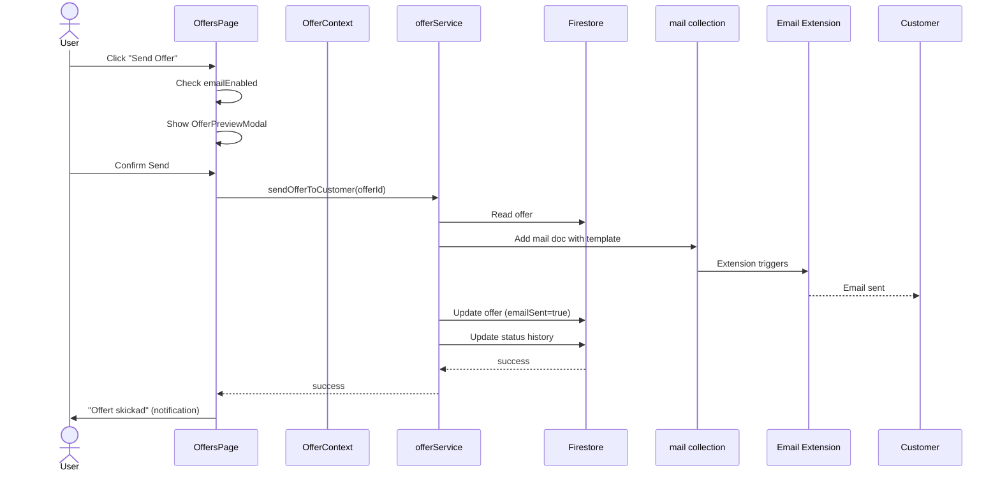

# Offers Module – Solution Architect Audit

**Date:** January 25, 2026  
**Status:** 🔴 Critical Issues Found

## Executive Summary

The offers module has **multiple critical issues** that prevent proper functionality:

### 🚨 Critical Issues
1. **Translation Corruption**: DA/DE/SV locales contain Swedish text instead of proper translations
2. **Hardcoded Strings**: Multiple components have hardcoded Swedish strings
3. **Email Sending**: Functional but requires Firebase extension configuration
4. **Missing Translation Keys**: Several keys used in code don't exist in locale files

### ✅ Working Components
- Service layer architecture is solid
- Firestore rules properly configured
- Email templates exist and are properly structured
- Core offer creation/status update logic works

---

## Issue #1: Translation Corruption 🔴 CRITICAL

### Problem
The DA (Danish), DE (German), and SV (Swedish) locale files all contain **identical Swedish text**. This means Danish and German users see Swedish text.

### Evidence
**File:** `src/locales/da/offers.json` (Danish)
```json
{
  "offers.title": "Offerter",  // ❌ This is Swedish, not Danish!
  "offers.subtitle": "Hantera och spåra kundofferter",  // ❌ Swedish
  "offers.createOffer": "Skapa offert från rapport",  // ❌ Swedish
  ...
}
```

**File:** `src/locales/de/offers.json` (German)
```json
{
  "offers.title": "Offerter",  // ❌ This is Swedish, not German!
  "offers.subtitle": "Hantera och spåra kundofferter",  // ❌ Swedish
  ...
}
```

### Impact
- Danish users see Swedish text (wrong language)
- German users see Swedish text (wrong language)
- Only Swedish and English work correctly

### Fix Required
All keys in `da/offers.json` and `de/offers.json` need proper translations:

**Danish (da):**
- "Offerter" → "Tilbud"
- "Hantera och spåra kundofferter" → "Administrer og spor kundetilbud"
- "Skapa offert från rapport" → "Opret tilbud fra rapport"

**German (de):**
- "Offerter" → "Angebote"
- "Hantera och spåra kundofferter" → "Kundenangebote verwalten und verfolgen"
- "Skapa offert från rapport" → "Angebot aus Bericht erstellen"

---

## Issue #2: Hardcoded Swedish Strings 🔴 HIGH

### Affected Files

#### `src/components/offers/OfferPreviewModal.tsx`
```tsx
// Line 47
<h2 className='text-xl font-semibold text-gray-900'>Förhandsgranska offert</h2>

// Line 51
aria-label='Stäng'

// Line 59
<strong>Kontrollera offerten nedan innan du skickar.</strong> Denna vy visar exakt
hur kunden kommer att se offerten.

// Line 86
Avbryt

// Line 89
{isLoading ? 'Skickar...' : 'Skicka offert'}
```

#### `src/components/offers/OffersPage.tsx`
```tsx
// Line 164
setNotification({ message: 'Offert skickad', type: 'success' });

// Line 169
setNotification({ message: 'Kunde inte skicka offert', type: 'error' });
```

#### `src/components/offers/PublicOfferView.tsx`
```tsx
// Line 259
{daysRemaining > 0 ? `${daysRemaining} days remaining` : 'Expiring soon'}

// Line 361
{processing ? 'Processing...' : 'Accept Offer'}
```

#### `src/components/offers/OffersList.tsx`
```tsx
// Line 222
{offer.customerEmail || 'No email'}

// Line 285, 322
{copying === offer.id ? '✔ Copied' : 'Copy Link'}
```

#### `src/components/offers/OfferDetail.tsx`
```tsx
// Line 46
label: 'Awaiting Response',

// Line 236
{t('offers.detail.statusHistory') || 'Status History'}

// Line 265
{t('offers.detail.quickActions') || 'Quick Actions'}

// Line 281
{t('offers.actions.sendReminder') || 'Send Reminder'}
```

### Fix Required
Add translation keys and replace all hardcoded strings with `t()` calls.

**New Keys Needed:**
```json
{
  "offers.preview.title": "Preview Offer",
  "offers.preview.close": "Close",
  "offers.preview.checkBeforeSending": "Check the offer below before sending. This view shows exactly how the customer will see the offer.",
  "offers.preview.cancel": "Cancel",
  "offers.preview.send": "Send Offer",
  "offers.preview.sending": "Sending...",
  "offers.sentSuccess": "Offer sent",
  "offers.sendError": "Could not send offer",
  "offers.public.daysRemaining": "{days} days remaining",
  "offers.public.expiringSoon": "Expiring soon",
  "offers.public.processing": "Processing...",
  "offers.public.acceptOffer": "Accept Offer",
  "offers.noEmail": "No email",
  "offers.copyLink": "Copy Link",
  "offers.linkCopied": "✔ Copied",
  "offers.detail.awaitingResponse": "Awaiting Response",
  "offers.detail.statusHistory": "Status History",
  "offers.detail.quickActions": "Quick Actions",
  "offers.actions.sendReminder": "Send Reminder"
}
```

---

## Issue #3: Email Sending Functionality ⚠️ REQUIRES SETUP

### Current State
The code is **correctly implemented** to send emails:

**File:** `src/services/offerService.ts` (lines 201-244)
```typescript
export const sendOfferToCustomer = async (offerId: string): Promise<void> => {
  try {
    const offer = await getOffer(offerId);
    if (!offer) throw new Error('Offer not found');

    // Add to mail collection for Trigger Email extension
    const mailRef = collection(db, 'mail');
    await addDoc(mailRef, {
      to: offer.customerEmail,
      template: {
        name: 'offer-sent',
        data: {
          customerName: offer.customerName,
          offerTitle: offer.title,
          offerDescription: offer.description,
          totalAmount: offer.totalAmount,
          currency: offer.currency,
          validUntil: offer.validUntil,
          publicLink: `${window.location.origin}/offer/public/${offerId}`,
        },
      },
    });

    // Update offer
    const offerRef = doc(db, 'offers', offerId);
    await updateDoc(offerRef, {
      emailSent: true,
      sentAt: serverTimestamp(),
      updatedAt: serverTimestamp(),
    });
    
    // ... status update
  } catch (error) {
    console.error('Error sending offer to customer:', error);
    throw new Error('Failed to send offer to customer');
  }
};
```

### Email Templates
✅ Templates exist in `email/templates/`:
- `offer-sent.hbs` / `offer-sent.txt.hbs`
- `offer-accepted.hbs` / `offer-accepted.txt.hbs`
- `offer-rejected.hbs` / `offer-rejected.txt.hbs`
- `offer-reminder.hbs` / `offer-reminder.txt.hbs`
- `offer-escalation.hbs` / `offer-escalation.txt.hbs`

### What's Needed
The Firebase "Trigger Email" extension must be:
1. Installed in Firebase Console
2. Configured to use the `mail` collection
3. Configured with email template mappings

### How to Verify
Run this in console to check if the extension is installed:
```javascript
// In browser console on the app
await checkEmailHealth();
// Should return 'ok' if extension is configured
```

The code already checks email health:
```typescript
// From OffersPage.tsx line 52-56
useEffect(() => {
  async function runHealthCheck() {
    const result = await checkEmailHealth();
    setEmailEnabled(result === 'ok');
  }
  runHealthCheck();
}, []);
```

**If email is disabled**, users see:
```typescript
// Line 145
if (!emailEnabled) {
  setNotification({
    message: 'Email is disabled. Use Copy Public Link instead.',
    type: 'warning',
  });
  return;
}
```

---

## Issue #4: Missing Translation Keys ⚠️ MEDIUM

Several translation keys are used in the code but don't exist in locale files:

### Missing Keys
```json
{
  // Used in OffersPage.tsx
  "offers.deleteConfirm": "Are you sure you want to delete the offer for {customerName}?",
  "offers.deletedSuccessfully": "Offer deleted successfully",
  
  // Used in OfferDetail.tsx with fallbacks
  "offers.detail.statusHistory": "Status History",
  "offers.detail.quickActions": "Quick Actions",
  "offers.actions.sendReminder": "Send Reminder"
}
```

These exist in the code with fallbacks (` || 'English text'`) but should be added to all locale files.

---

## Architecture Review ✅

### Service Layer
**File:** `src/services/offerService.ts`

✅ **Strengths:**
- Clean separation of concerns
- Proper error handling
- Status history tracking
- Branch-scoped queries for permissions
- Public link generation

✅ **Key Functions:**
- `createOffer()` - Links to report, validates branch access
- `getOffers()` - Permission-aware queries (superadmin → all, branch admin → branch, inspector → own)
- `sendOfferToCustomer()` - Mail collection integration
- `acceptOffer()` / `rejectOffer()` - Customer response handling
- `sendReminderToCustomer()` - Follow-up emails
- `extendOfferValidity()` - Date extension with history

### Context Layer
**File:** `src/contexts/OfferContext.tsx`

✅ **Provides:**
- `offers` state
- `fetchOffers()` / `fetchOffer()`
- `createOfferFromReport()`
- `updateStatus()`
- `sendOffer()`

### Firestore Rules
**File:** `firestore.rules` (lines 418-450)

✅ **Properly configured:**
- Public read for pending/awaiting_response offers (for customer acceptance)
- Customer read access by customerId or companyId
- Customer read for building-linked offers
- Internal users: superadmin (all), branch admin (branch), inspector (own or branch)

---

## Sequence: How Offer Sending Works



---

## Recommended Fixes (Priority Order)

### 1. Fix Translation Corruption (CRITICAL)
**Priority:** P0 - Blocks DA/DE users

**Action:**
- [ ] Translate all keys in `src/locales/da/offers.json` to Danish
- [ ] Translate all keys in `src/locales/de/offers.json` to German
- [ ] Verify EN and SV are correct

**Files:** 
- [src/locales/da/offers.json](../src/locales/da/offers.json)
- [src/locales/de/offers.json](../src/locales/de/offers.json)

### 2. Replace Hardcoded Strings (HIGH)
**Priority:** P1 - Breaks i18n

**Action:**
- [ ] Add missing translation keys to all locale files
- [ ] Replace hardcoded strings with `t()` calls in:
  - [OfferPreviewModal.tsx](../src/components/offers/OfferPreviewModal.tsx)
  - [OffersPage.tsx](../src/components/offers/OffersPage.tsx)
  - [PublicOfferView.tsx](../src/components/offers/PublicOfferView.tsx)
  - [OffersList.tsx](../src/components/offers/OffersList.tsx)
  - [OfferDetail.tsx](../src/components/offers/OfferDetail.tsx)

### 3. Add Missing Translation Keys (MEDIUM)
**Priority:** P2 - Has fallbacks but incomplete

**Action:**
- [ ] Add all missing keys documented above to locale files
- [ ] Remove fallback strings from code once keys exist

### 4. Verify Email Extension (INFO)
**Priority:** P3 - Already has graceful fallback

**Action:**
- [ ] Check Firebase Console → Extensions → Trigger Email
- [ ] Verify `mail` collection is monitored
- [ ] Test sending an offer to confirm email delivery

---

## Code References

### Core Files
- Service: [src/services/offerService.ts](../src/services/offerService.ts)
- Context: [src/contexts/OfferContext.tsx](../src/contexts/OfferContext.tsx)
- Main UI: [src/components/offers/OffersPage.tsx](../src/components/offers/OffersPage.tsx)
- Rules: [firestore.rules](../firestore.rules) (lines 418-450)

### Translation Files
- [src/locales/en/offers.json](../src/locales/en/offers.json) ✅
- [src/locales/sv/offers.json](../src/locales/sv/offers.json) ✅
- [src/locales/da/offers.json](../src/locales/da/offers.json) ❌ Wrong language
- [src/locales/de/offers.json](../src/locales/de/offers.json) ❌ Wrong language

### Components with Hardcoded Strings
- [src/components/offers/OfferPreviewModal.tsx](../src/components/offers/OfferPreviewModal.tsx)
- [src/components/offers/OffersPage.tsx](../src/components/offers/OffersPage.tsx)
- [src/components/offers/PublicOfferView.tsx](../src/components/offers/PublicOfferView.tsx)
- [src/components/offers/OffersList.tsx](../src/components/offers/OffersList.tsx)
- [src/components/offers/OfferDetail.tsx](../src/components/offers/OfferDetail.tsx)

---

## Summary

**Can it send offers?** ✅ Yes, the code is correct.  
**Will emails work?** ⚠️ Only if Firebase extension is configured.  
**Are translations working?** ❌ No, DA/DE show Swedish text.  
**Are there hardcoded strings?** ❌ Yes, multiple components.

**Recommended action:** Fix translations first (P0), then hardcoded strings (P1), then verify email setup (P3).
