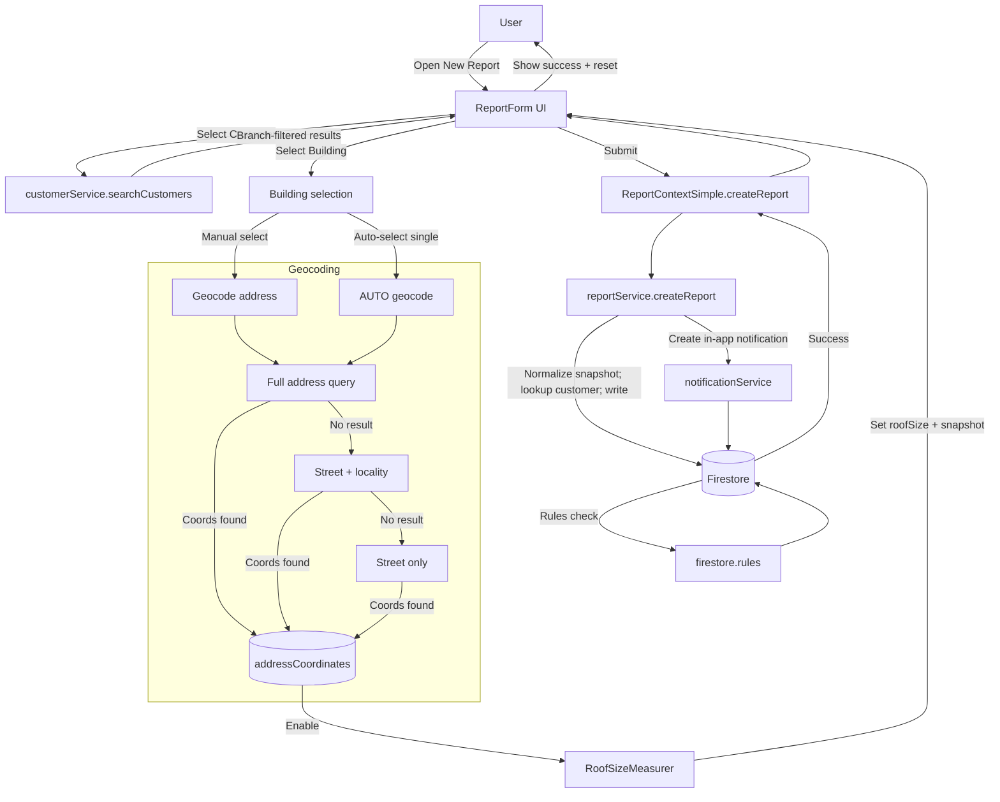
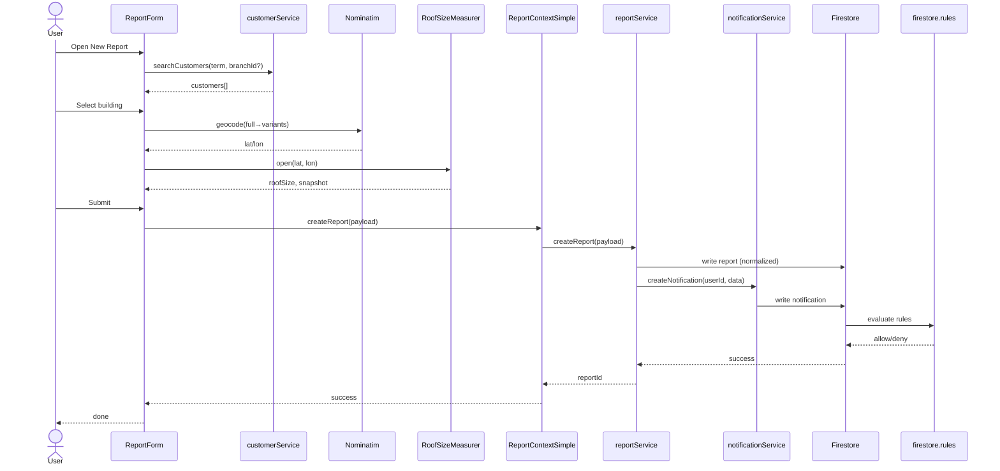

# Create New Report – Flow Map

Below are two complementary diagrams:
- Flowchart: user journey and conditional logic.
- Sequence: service interactions and rule checks.

Open this file in VS Code and use the Markdown Preview to see the diagrams. GitHub also renders Mermaid.

## Flowchart

## Sequence

## Code Pointers
- UI: [src/components/ReportForm.tsx](../src/components/ReportForm.tsx)
- Measurer: [src/components/RoofSizeMeasurer.tsx](../src/components/RoofSizeMeasurer.tsx)
- Context: [src/contexts/ReportContextSimple.tsx](../src/contexts/ReportContextSimple.tsx)
- Report service: [src/services/reportService.ts](../src/services/reportService.ts)
- Notification service: [src/services/notificationService.ts](../src/services/notificationService.ts)
- Rules: [firestore.rules](../firestore.rules)

## Improvement Targets
- Unified coordinates: Single source of truth for `addressCoordinates`; auto-open measurer on ready.
- Centralized notifications: Emit from services only to avoid duplicates; leverage updated rules.
- Branch discipline: Enforce `branchId` in `searchCustomers` for non-superadmin callers.
